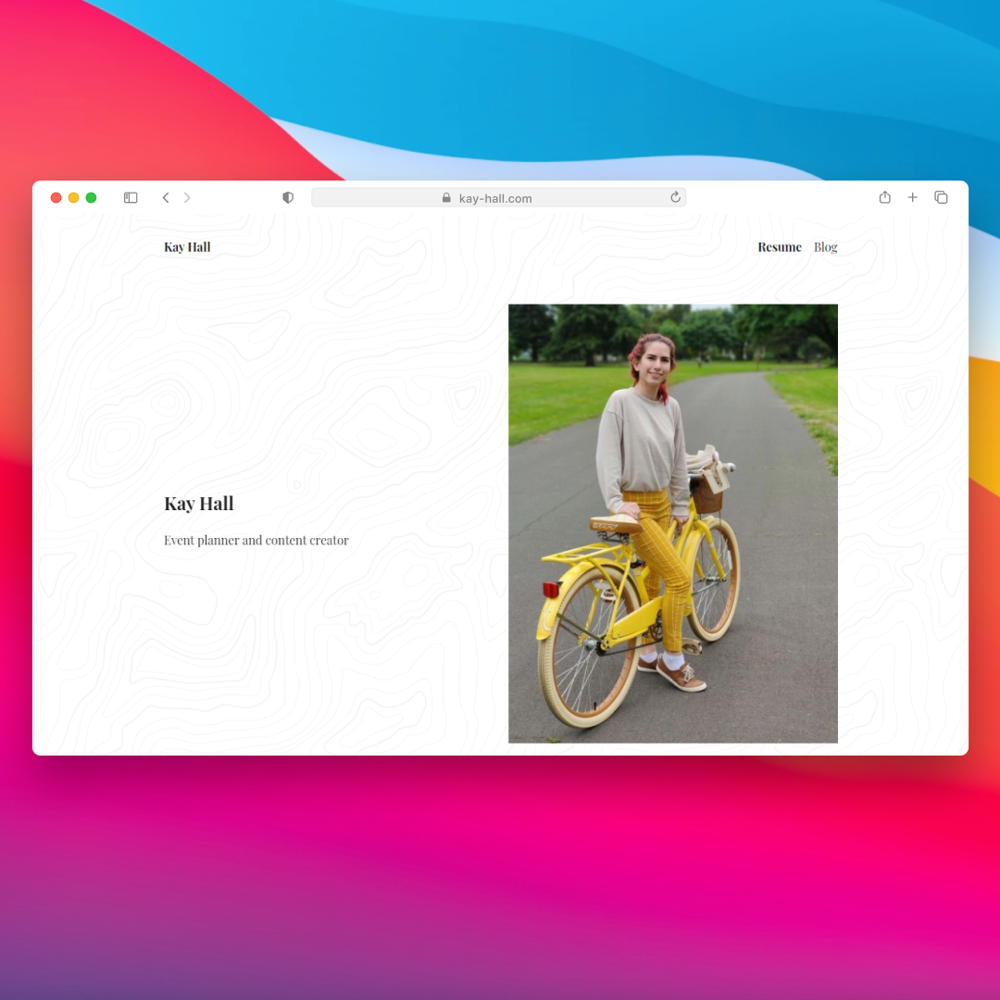

## What?

[kay-hall.com](https://kay-hall.com) is a portfolio for Kay Hall to showcase her graphic design and event planning work.

## Why?

Kay Hall has a variety of work that isn't easily included on a resume for job applications, such as photos from events she has planned, or flyers she has created. This site was commissioned to collect these assets at a convenient domain for prospective employers.

## How?

This site was build using [Gatsby](https://gatsbyjs.com) for the front end and [Sanity](https://sanity.io/) as the content management system. Gatsby is a React-based static site generator which allows for building great website experiences. Sanity is a Javascript-based content management system build with static site generators like Gatsby in mind. The pair of these two tools allows for developers to be productive while building the site, but still offers a good content-editing experinece for non-technical website owners as they can edit the site content with a nice user interface.
