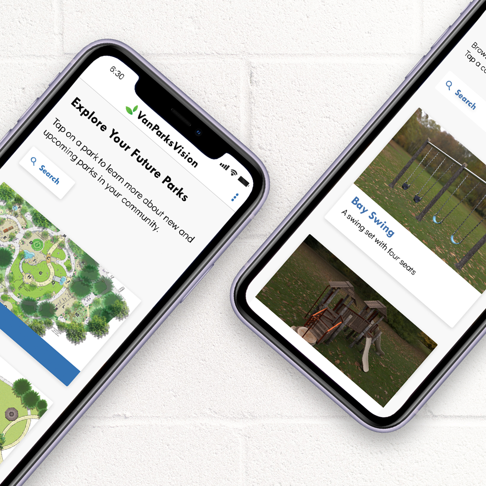

## What?

VanParksVision is a mobile app that uses augmented reality to reimagine upcoming Vancouver, Washington parks.

## Why?

[The City of Vancouver, Washington](https://www.cityofvancouver.us/) launched an initative called [Project Play](https://www.cityofvancouver.us/parksrec/page/project-play) in order to rebuild a popular playground in the city known as [Marshall Park](https://www.cityofvancouver.us/parksrec/page/marshall-park). They were partnering with a non-profit known as [Harpers Playground](https://www.harpersplayground.org/playgrounds/marshall-park/) in order to rebuild it, and they wanted to raise awareness of the project and gain community support. They city came to the team I was a part of to create a multi-media experience that was more interactive than architecture illustration they currently had.

## How?

The app was build using [React Native](https://reactnative.dev/) so we could have a cross platform experience. For the augmented reality features, we used an open source library known as [ViroReact](https://viromedia.com/viroreact).

Our larger team was broken down into smaller departments with different responsibilities. I was the head of the development team, where I managed 5 developers which were responsible for building the app and [the promotional website](https://dtc-wsuv.org/projects/vanparksvision/) for the project.

Read more about the process and work of the other departments on this project at the [VanParksVision case study](https://dtc-wsuv.org/projects/vanparksvision/casestudy/).
